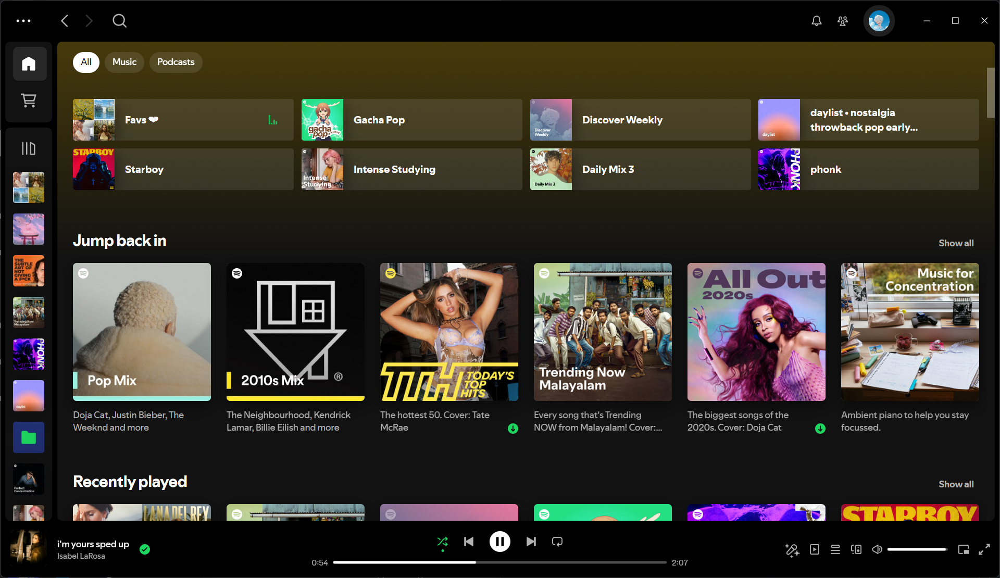
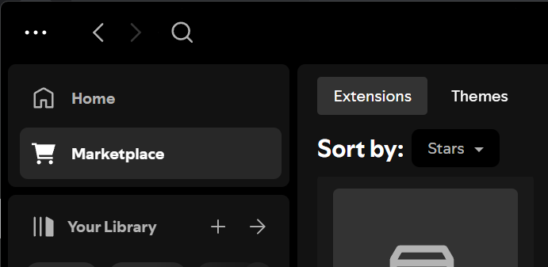

# Spicetify Extensions

This repository contains a Spicetify extension created by [me](github.com/sanoojes).

## LibX Reborn

### **Description:**

Enjoy a familiar and convenient way to manage your music library with LibX Reborn! This extension seamlessly re-integrates the classic Library X view into the new Global Nav interface, giving you a consistent and user-friendly experience.

### **Features:**

- **Restores Library X:** Experience the classic Library X layout, offering a convenient way to browse and manage your music library.

### **Screenshots:**

### **Installation:**

1. **Download:** Download the latest version of the LibX Reborn extension: [Download LibX Reborn](https://github.com/sanoojes/spicetify-extenstions/raw/main/LibX-Reborn/src/LibX-Reborn.js)
2. **Locate Spicetify Config Folder:** Open your Spicetify Config folder, typically located at:
   - **macOS/Linux:** `~/.config/spicetify/`
   - **Windows:** `%AppData%\Roaming\spicetify`
3. **Place Extension File:** Navigate to the "Extensions" folder within the Spicetify Config folder and place the downloaded `LibX-Reborn.js` file inside.
4. **Install:** Open your terminal (or Command Prompt on Windows) and run the command: `spicetify config extensions LibX-Reborn.js`
5. **Apply Changes:** Run the command: `spicetify apply`
6. **Restart Spotify:** Restart Spotify for the changes to take effect.

### **Usage:**

Once installed, the Library X view will become available again within the Spotify interface. You'll find it where your music library options are usually located.

### **Known Issues:**

- The extension may not be fully compatible with all themes or modifications to the Global Nav.
- If you encounter any issues, please submit a bug report on this repository.

### **Contribute:**

Contributions are welcome! Feel free to submit bug reports, feature requests, or even code improvements.
