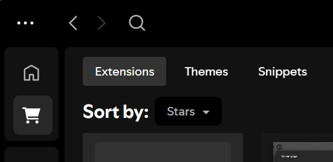
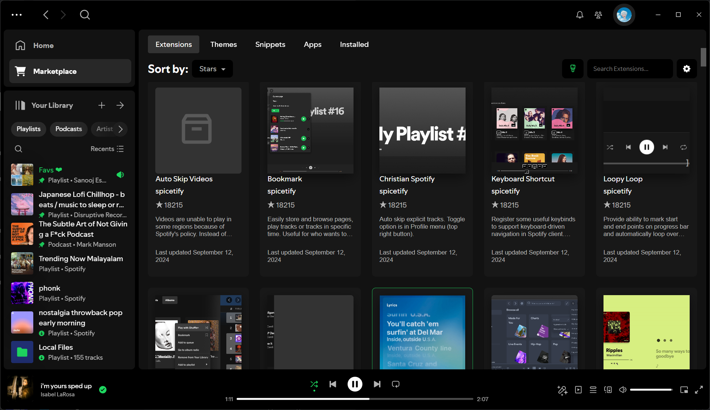
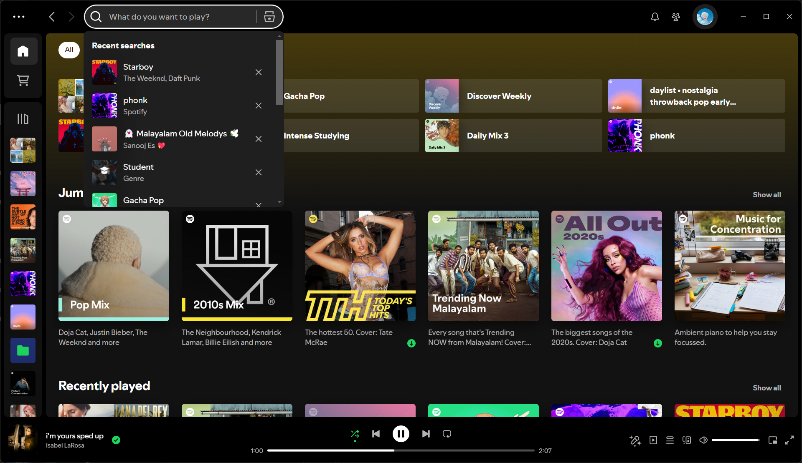

# Spicetify Extensions

This repository contains a Spicetify extension created by [me](github.com/sanoojes).

## LibX Reborn

### **Description:**

Enjoy a familiar and convenient way to manage your music library with LibX Reborn! This extension seamlessly re-integrates the classic Library X view into the new Global Nav interface, giving you a consistent and user-friendly experience.

### **Features:**

- **Restores Library X:** Experience the classic Library X layout, offering a convenient way to browse and manage your music library.

### **Screenshots:**

### Installation:

- **Easiest Method - Install from Spicetify Marketplace:**
      - Search for "LibX Reborn" in your Spicetify Marketplace and click install.  (This requires having the Marketplace custom app set up).

#### **Manual Installation:** 
1. **Download LibX Reborn:**
   - **For Automatic Updates (Recommended):** 
     - Click this link to download the **remote** version: [https://raw.githubusercontent.com/sanoojes/spicetify-extensions/master/LibX-Reborn/remote/LibX-Reborn.js](https://raw.githubusercontent.com/sanoojes/spicetify-extensions/master/LibX-Reborn/remote/LibX-Reborn.js) 
     - This version automatically fetches the latest updates.
   - **For Local Installation:**
     - Click this link to download the **local** version: [https://raw.githubusercontent.com/sanoojes/spicetify-extensions/master/LibX-Reborn/src/LibX-Reborn.js](https://raw.githubusercontent.com/sanoojes/spicetify-extensions/master/LibX-Reborn/src/LibX-Reborn.js) 
   - Save the file as `LibX-Reborn.js` in a location you can easily access (only if manually installing).

2. **Open Spicetify Extensions Folder:**
   - **macOS/Linux:** Open a terminal and run: `xdg-open ~/.config/spicetify/Extensions` (or navigate manually to `~/.config/spicetify/Extensions`).
   - **Windows:** Open a Run dialog (Win + R), paste `%AppData%\Roaming\spicetify\Extensions` and press Enter.

3. **Place Extension File:**
   - Move or copy the downloaded `LibX-Reborn.js` file into the opened "Extensions" folder.

4. **Enable the Extension:**
   - Open a terminal or command prompt and run: `spicetify config extensions LibX-Reborn.js`

5. **Apply Changes & Restart:**
   - Run the command: `spicetify apply`
   - Fully close and reopen Spotify for the LibX Reborn extension to take effect. 

### Uninstallation:

1. **Remove the Extension File:**
   - Navigate back to your Spicetify "Extensions" folder (see step 2 of Installation).
   - Delete the `LibX-Reborn.js` file.

2. **Disable the Extension:**
   - Open your terminal or command prompt and run: `spicetify config extensions LibX-Reborn.js-`

3. **Apply Changes & Restart:**
   - Run the command: `spicetify apply`
   - Fully close and reopen Spotify to complete the uninstallation process.

### **Usage:**

Once installed, the Library X view will become available again within the Spotify interface. You'll find it where your music library options are usually located.

### **Known Issues:**

- The extension may not be fully compatible with all themes or modifications to the Global Nav.
- If you encounter any issues, please submit a bug report on this repository.

### **Contribute:**

Contributions are welcome! Feel free to submit bug reports, feature requests, or even code improvements.
